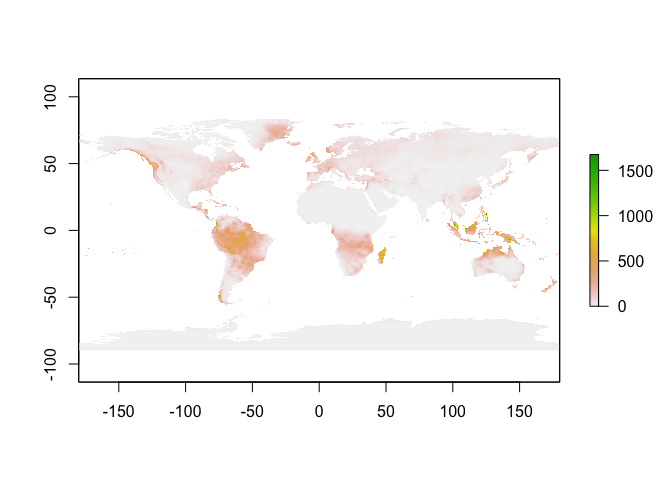

TerraClimate
================

#### install and load libraries

``` r
pkgTest <- function(x)
{
  if (x %in% rownames(installed.packages()) == FALSE) {
    install.packages(x, dependencies= TRUE)    
  }
  library(x, character.only = TRUE)
}
neededPackages <- c("raster")

for (package in neededPackages){pkgTest(package)}
```

    ## Loading required package: sp

#### define function getTerra. source: <https://rdrr.io/github/MoisesExpositoAlonso/rbioclim/src/R/getTerra.R>

``` r
#' getTerra
#' Query and load into R data from http://www.climatologylab.org/terraclimate.html
#'
#' @param start start
#' @param end
#' @param byyear
#' @param listyears Instead of start, end, and byyer, user can provide the list of year
#' @param path by default, "data"
#' @variableclim either tmax, tmin, ppt
#'
#' @return list of rasterstack
#' @export
#'
#'
getTerra<-function(start=1958,end=2017,byyear=10,listyears=NULL,variableclim='ppt',path='data'){
  stopifnot(variableclim %in% c('tmax','tmin','ppt'))
  stopifnot(start>=1958)
  stopifnot(end<2018)
  stopifnot(start<end)
  stopifnot(byyear>=1 )
  if(is.null(listyears)) listyears<-seq(start,end,byyear)

  require(raster)

  # helper functions
   # .query<-function(terrafile,path){
   #    message("Downloading terraclimate layer ", terrafile)
   #    cmd<-paste0('wget / https://climate.northwestknowledge.net/TERRACLIMATE-DATA/',terrafile,' ')
   #    system(cmd)
   # }
 .download <- function(path,terrafile, downloadmethod="wget") {
      aurl=paste0('https://climate.northwestknowledge.net/TERRACLIMATE-DATA/',gsub(pattern = "\\.nc$", "", terrafile))
      filename<-paste0(path,"/",terrafile)
      fn <- paste(tempfile(), '.download', sep='')
      res <- utils::download.file(url=aurl, destfile=fn, method=downloadmethod, quiet = FALSE, mode = "wb", cacheOK = TRUE) # other people and me problem with method="auto"
      if (res == 0) {
        w <- getOption('warn')
        on.exit(options('warn' = w))
        options('warn'=-1)
        if (! file.rename(fn, filename) ) {
          # rename failed, perhaps because fn and filename refer to different devices
          file.copy(fn, filename)
          file.remove(fn)
        }
        } else {
          stop('could not download the file' )
        }
      }
  .files<-function(path,variableclim,listyears){
      return(paste0("TerraClimate_",variableclim,"_",listyears,".nc"))
  }
  .checkfiles<-function(path,terrafile){
    foundfiles<-list.files(path = path,pattern = paste0("TerraClimate_"),full.names = T)
    if(paste0(path,"/",terrafile) %in% foundfiles){
      return(TRUE)
    }else{
      return(FALSE)
    }
  }
  .read<-function(terrafiles){
    rall = lapply(terrafiles,function(myr) {
      message(myr)
      rtmp=stack(lapply(1:12, function(i) raster(myr,band=i,ncdf=TRUE)))
      crs(rtmp)<- "+proj=longlat +datum=WGS84 +ellps=WGS84 +towgs84=0,0,0"
      return(rtmp)})
    return(rall)
  }
  .getTerra<-function(...){
    terrafiles<-.files(path,variableclim,listyears)
    for (i in terrafiles){
      if(!.checkfiles(path,i)){
        .download(path,i)
      }
    }
    r<-.read(paste0(path,"/",terrafiles))
    # message('Saving .gri/.grd files into ',paste0("data/terraclimate-",variableclim))
    # raster::writeRaster(r,filename = paste0("data/terraclimate-",variableclim), overwrite=T)
    return(r)
    }
  # action
  r<-.getTerra(start,end,byyear,listyears,variableclim,path)
  message('Done')
  return(r)
}
```

#### use getTerra to download data. Note: each year's file is ~58 MB.

``` r
getTerra(start=1958,end=1968,byyear=10,listyears=NULL,variableclim='ppt',path='data_terra_climate')
```

    ## data_terra_climate/TerraClimate_ppt_1958.nc

    ## Loading required namespace: ncdf4

    ## Warning in .varName(nc, varname, warn = warn): varname used is: ppt
    ## If that is not correct, you can set it to one of: ppt, station_influence

    ## Warning in .varName(nc, varname, warn = warn): varname used is: ppt
    ## If that is not correct, you can set it to one of: ppt, station_influence

    ## Warning in .varName(nc, varname, warn = warn): varname used is: ppt
    ## If that is not correct, you can set it to one of: ppt, station_influence

    ## Warning in .varName(nc, varname, warn = warn): varname used is: ppt
    ## If that is not correct, you can set it to one of: ppt, station_influence

    ## Warning in .varName(nc, varname, warn = warn): varname used is: ppt
    ## If that is not correct, you can set it to one of: ppt, station_influence

    ## Warning in .varName(nc, varname, warn = warn): varname used is: ppt
    ## If that is not correct, you can set it to one of: ppt, station_influence

    ## Warning in .varName(nc, varname, warn = warn): varname used is: ppt
    ## If that is not correct, you can set it to one of: ppt, station_influence

    ## Warning in .varName(nc, varname, warn = warn): varname used is: ppt
    ## If that is not correct, you can set it to one of: ppt, station_influence

    ## Warning in .varName(nc, varname, warn = warn): varname used is: ppt
    ## If that is not correct, you can set it to one of: ppt, station_influence

    ## Warning in .varName(nc, varname, warn = warn): varname used is: ppt
    ## If that is not correct, you can set it to one of: ppt, station_influence

    ## Warning in .varName(nc, varname, warn = warn): varname used is: ppt
    ## If that is not correct, you can set it to one of: ppt, station_influence

    ## Warning in .varName(nc, varname, warn = warn): varname used is: ppt
    ## If that is not correct, you can set it to one of: ppt, station_influence

    ## data_terra_climate/TerraClimate_ppt_1968.nc

    ## Warning in .varName(nc, varname, warn = warn): varname used is: ppt
    ## If that is not correct, you can set it to one of: ppt, station_influence

    ## Warning in .varName(nc, varname, warn = warn): varname used is: ppt
    ## If that is not correct, you can set it to one of: ppt, station_influence

    ## Warning in .varName(nc, varname, warn = warn): varname used is: ppt
    ## If that is not correct, you can set it to one of: ppt, station_influence

    ## Warning in .varName(nc, varname, warn = warn): varname used is: ppt
    ## If that is not correct, you can set it to one of: ppt, station_influence

    ## Warning in .varName(nc, varname, warn = warn): varname used is: ppt
    ## If that is not correct, you can set it to one of: ppt, station_influence

    ## Warning in .varName(nc, varname, warn = warn): varname used is: ppt
    ## If that is not correct, you can set it to one of: ppt, station_influence

    ## Warning in .varName(nc, varname, warn = warn): varname used is: ppt
    ## If that is not correct, you can set it to one of: ppt, station_influence

    ## Warning in .varName(nc, varname, warn = warn): varname used is: ppt
    ## If that is not correct, you can set it to one of: ppt, station_influence

    ## Warning in .varName(nc, varname, warn = warn): varname used is: ppt
    ## If that is not correct, you can set it to one of: ppt, station_influence

    ## Warning in .varName(nc, varname, warn = warn): varname used is: ppt
    ## If that is not correct, you can set it to one of: ppt, station_influence

    ## Warning in .varName(nc, varname, warn = warn): varname used is: ppt
    ## If that is not correct, you can set it to one of: ppt, station_influence

    ## Warning in .varName(nc, varname, warn = warn): varname used is: ppt
    ## If that is not correct, you can set it to one of: ppt, station_influence

    ## Done

    ## [[1]]
    ## class       : RasterStack 
    ## dimensions  : 4320, 8640, 37324800, 12  (nrow, ncol, ncell, nlayers)
    ## resolution  : 0.04166667, 0.04166667  (x, y)
    ## extent      : -180, 180, -90, 90  (xmin, xmax, ymin, ymax)
    ## coord. ref. : +proj=longlat +datum=WGS84 +ellps=WGS84 +towgs84=0,0,0 
    ## names       : precipitation_amount.1, precipitation_amount.2, precipitation_amount.3, precipitation_amount.4, precipitation_amount.5, precipitation_amount.6, precipitation_amount.7, precipitation_amount.8, precipitation_amount.9, precipitation_amount.10, precipitation_amount.11, precipitation_amount.12 
    ## 
    ## 
    ## [[2]]
    ## class       : RasterStack 
    ## dimensions  : 4320, 8640, 37324800, 12  (nrow, ncol, ncell, nlayers)
    ## resolution  : 0.04166667, 0.04166667  (x, y)
    ## extent      : -180, 180, -90, 90  (xmin, xmax, ymin, ymax)
    ## coord. ref. : +proj=longlat +datum=WGS84 +ellps=WGS84 +towgs84=0,0,0 
    ## names       : precipitation_amount.1, precipitation_amount.2, precipitation_amount.3, precipitation_amount.4, precipitation_amount.5, precipitation_amount.6, precipitation_amount.7, precipitation_amount.8, precipitation_amount.9, precipitation_amount.10, precipitation_amount.11, precipitation_amount.12

#### read in one netCDF file as raster and plot

``` r
#use brick to read in all the layers
r = brick("data_terra_climate/TerraClimate_ppt_1958.nc")
```

    ## Warning in .varName(nc, varname, warn = warn): varname used is: ppt
    ## If that is not correct, you can set it to one of: ppt, station_influence

``` r
plot(r[[1]])
```


